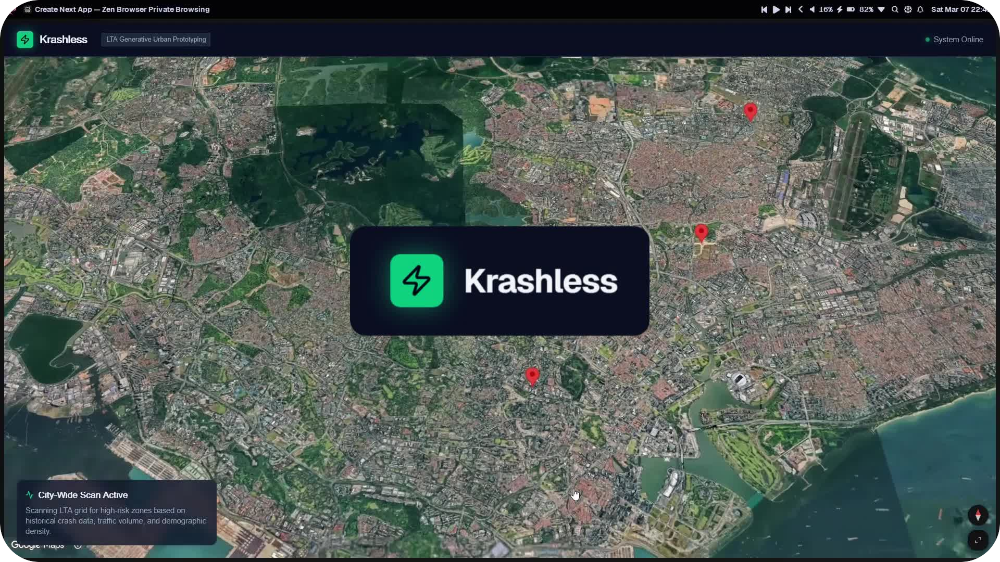
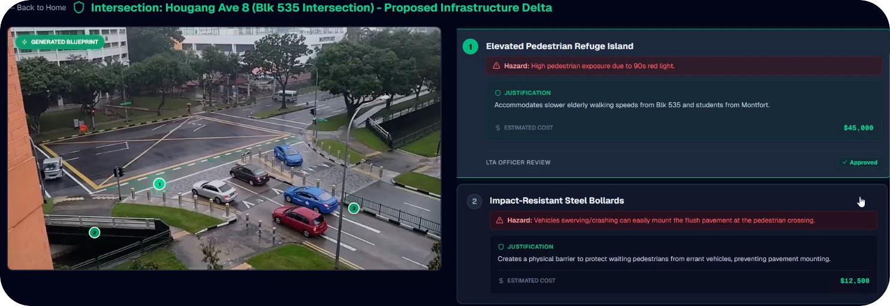

<div align="center"> <!-- use align as CSS is not allowed on GitHub markdown https://github.com/orgs/community/discussions/22728 -->
   <!-- Logo -->
  <h1>Krashless</h1> <!-- Project Name -->
  <p> <!-- Description -->
    An agentic dashboard which makes intersections safer by reimagining proposed modification live <br>
    2nd Place Winner ($30k) at <a href="https://cerebralvalley.ai/e/gemini-3-singapore-hackathon">Gemini 3 Hackathon Singapore</a> <br>
    Live Site: <a href="https://krashless.vercel.app">krashless.vercel.app</a> <br>
  </p>
  <p> <!-- Built With -->
    Built With:
    <a href="https://ai-sdk.dev">AI SDK</a> &bull;
    <a href="https://ai.google.dev/gemini-api/docs/models/gemini-3.1-pro-preview">Gemini 3.1 Pro</a> &bull;
    <a href="https://ai.google.dev/gemini-api/docs/models/gemini-3.1-flash-image-preview">Nano Banana 2</a> &bull;
    <a href="https://developers.google.com/maps/documentation/tile/3d-tiles">Google Maps Photorealistic 3D Tiles</a>
  </p>
</div>

---

<details>
<summary>Table of Contents</summary>

- [About](#about)
  - [Demo Video](#demo-video)
- [Features](#features)
- [Getting Started](#getting-started)
  - [Prerequisites](#prerequisites)
  - [Installation](#installation)
  - [Execution](#execution)
</details>

## About

*"Singaporeans are bad pedestrians, and even worse drivers."*

**Krashless** is a pitch for transport authorities around the globe (eg [LTA](https://www.lta.gov.sg)) aimed at making accident-prone intersections safer. It's an agentic dashboard that analyzes live traffic feeds & proposes structural modifications to dangerous intersections, dynamically generating visuals & itemizing the costs for these changes. 

By pulling in diverse data sources & using advanced AI models, Krashless allows traffic infrastructure employees to visualize & evaluate safety improvements before any physical work begins.

### Demo Video

<div align="center">
  <a href="https://youtu.be/uI_-RyKILfY">
    
  </a>
  <p><i>Click the image to watch the short demo</i></p>
</div>

## Features

- **Live Data Integration:** CCTV feeds, demographics (eg from HDB), zoning info & hazard stats (eg from LTA)
- **Spatial Data:** Google Maps Photorealistic 3D Tiles API for rich spatial and geographical context (visuals only)
- **AI Hazard Detection:** Gemini 3.1 Pro analyzes real-time traffic conditions & identify exactly *why* a specific intersection is dangerous
- **Generative Infrastructure Proposals:** Nano Banana 2 generates predicted images of new, safer intersections
- **Reasoning:** Highlight changed parts with markers, providing justification of changes & estimated cost
- **Human-in-the-Loop:** Users can still manually review modifications re-generate the proposed intersection (no images yet) if unsatisfied

<div align=center>
  
  <p><i>Results page with generated modified image</i></p>
</div>

## Getting Started

### Prerequisites

1. [Create GCP Project](https://console.cloud.google.com/projectcreate)
2. Go to [APIs & Services](https://console.cloud.google.com/apis)
3. Enable [Maps JavaScript API](https://console.cloud.google.com/apis/library/generativelanguage.googleapis.com)
4. Enable [Google Gemini API](https://console.cloud.google.com/apis/library/generativelanguage.googleapis.com)
5. [Create Credentials on Google Maps Platform](https://console.cloud.google.com/google/maps-apis/credentials) -> API Key
6. [Create Credentials](https://console.cloud.google.com/apis/credentials) -> API Key -> Restrict to "Generative Language API"

`.env` file
```env
GOOGLE_GENERATIVE_AI_API_KEY= 
NEXT_PUBLIC_GOOGLE_MAPS_API_KEY=
```

### Installation

```bash
npm i
```

### Execution

```
npm run dev
```

## License <!-- omit in toc -->

Distributed under the MIT License.

## Acknowledgements  <!-- omit in toc -->

- [adore_blvnk](https://x.com/adore_blvnk)
- [Kai Jie](https://github.com/codebreaker64)
